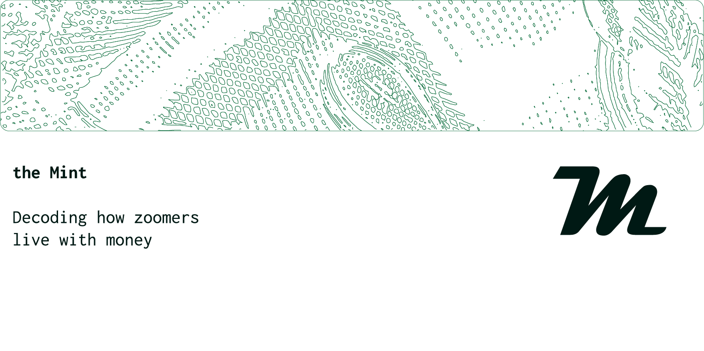

<picture>
  <source media="(prefers-color-scheme: dark)" srcset="assets/banners/banner-dark.png">
  <source media="(prefers-color-scheme: light)" srcset="assets/banners/banner-light.png">
  
</picture>

Behavioral study — Pretest phase ongoing — March 2026

The Mint is a behavioral study on the financial habits of young people. Over 12 months, a group of volunteers records every financial transaction — income, expenses, transfers — through a structured tracking tool.

## Objectives

The general objective of this study is to understand how our generation lives with money. Specifically, it aims to :

- Collect pseudoanonymized data on the financial habits of young people
- Build an application for personal finance tracking
- Develop a financial decision-making tool

## Research question

> Does knowing in advance what a financial decision will cost actually change the way we use our money ?

## Roadmap

| Phase | Participants | Objective | Status |
|---|---|---|---|
| Pretest | 12 | Collect first data and test the protocol | Ongoing |
| Pilot phase | up to 30 | Improve the tool, build the application | Upcoming |
| Experimental phase | up to 1,000 | Develop the decision-making tool | Upcoming |
| Large scale | up to 100,000 | Finalize and deploy | Upcoming |

*Target : close the pilot phase by end of 2027.*

## Infrastructure

| Tool | Role |
|---|---|
| Google Forms | Transaction data collection |
| Google Sheets | Storage, analysis and visualization |
| Google Drive | Personal workspace for each participant |
| n8n *(upcoming)* | Data entry automation |

*The full architecture is documented in the technical guide.*

## Repo structure
```
themint/
  index.html        — Landing page
  data.json         — Project metrics
  README.md         — This file
  /docs             — Mintlify documentation
  /legal            — Participation agreement
  /assets           — Logo and visual assets
```

## Documentation

The full project documentation is available on Mintlify.

[themint.mintlify.app](https://themint.mintlify.app)

## Follow the project

- Threads — *coming soon*
- GitHub Issues — to suggest improvements

## Rights and license

© the Mint 2026. All rights reserved.

All data collected in this study is anonymized prior to any publication. The methodology, tools and visual identity of the project are the exclusive property of the initiator.

*Initiated by **Estève Alvin KASSA** — Cotonou, Benin*
